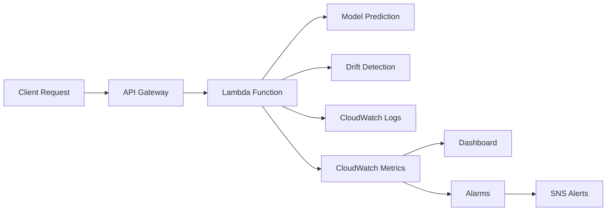

# ml-drift-detection
A model monitoring and drift detection system.
# MLOps Drift Monitor 

A complete MLOps monitoring system that detects data drift and model performance degradation in production. Built with AWS Lambda, CloudWatch, and real-time alerting.


## What This Does

- **Deploys a production ML model** (house price predictor) to AWS Lambda
- **Monitors incoming data** for distribution shifts and anomalies
- **Detects drift in real-time** using statistical tests
- **Sends alerts** when model performance degrades
- **Provides dashboards** for visualization and monitoring

Perfect for learning production MLOps practices and understanding how models behave in the wild.

## Architecture



## Quick Start

### Prerequisites
- AWS Account with CLI configured
- Python 3.9+
- GitHub Codespaces (recommended) or local development environment

### 1. Clone and Setup
```bash
git clone https://github.com/yourusername/mlops-drift-monitor.git
cd mlops-drift-monitor

# Install dependencies
pip install -r requirements.txt
```

### 2. Train the Baseline Model
```bash
python src/model/train.py
```
This creates your baseline model and training statistics for drift comparison.

### 3. Deploy to AWS
```bash
# Make sure AWS credentials are configured
aws configure

# Deploy the model
./deploy.sh
```

### 4. Test the System
```bash
# Send normal requests
python test_normal_traffic.py

# Simulate data drift
python test_drift_simulation.py
```

## Monitoring Features

### Data Drift Detection
- **Feature-level drift**: Monitors each input feature for distribution changes
- **Statistical tests**: Z-score analysis and distribution comparisons
- **Configurable thresholds**: Set your own drift sensitivity levels

### Real-time Alerts
- CloudWatch alarms trigger when drift scores exceed thresholds
- SNS notifications to email/Slack
- Dashboard visualization of trends

### Performance Tracking
- Prediction monitoring and logging
- Model confidence scoring
- Historical trend analysis

## Experiment Ideas

### Basic Monitoring
1. **Generate normal traffic** and establish baselines
2. **Watch the dashboard** as predictions come in
3. **Set up alerts** for different drift thresholds

### Advanced Testing
1. **Gradual drift simulation** - slowly change data distributions
2. **Sudden concept drift** - abrupt changes in data patterns
3. **Seasonal patterns** - cyclical changes in input data
4. **Performance degradation** - compare predictions to ground truth

## Project Structure

```
mlops-drift-monitor/
├── src/
│   ├── model/
│   │   ├── train.py              # Model training script
│   │   ├── predict.py            # Prediction utilities
│   │   └── drift_detector.py     # Drift detection logic
│   ├── api/
│   │   └── lambda_handler.py     # AWS Lambda function
│   └── monitoring/
│       ├── metrics_collector.py  # CloudWatch integration
│       └── dashboard.py          # Dashboard setup
├── tests/
│   ├── test_normal_traffic.py    # Normal traffic simulation
│   └── test_drift_simulation.py  # Drift testing scripts
├── infrastructure/
│   ├── cloudformation.yaml       # Infrastructure as code
│   └── terraform/                # Alternative IaC
├── notebooks/
│   └── drift_analysis.ipynb      # Exploratory analysis
├── requirements.txt
├── deploy.sh
└── README.md
```

## 🔧 Configuration

### Environment Variables
```bash
export AWS_REGION=us-east-1
export DRIFT_THRESHOLD=2.0
export ALERT_EMAIL=your-email@domain.com
```

### Model Parameters
Edit `src/model/train.py` to modify:
- Training data generation
- Model hyperparameters
- Feature engineering
- Drift detection sensitivity

## Dashboard Metrics

The CloudWatch dashboard tracks:
- **Prediction values** over time
- **Drift scores** for each feature
- **Request volume** and latency
- **Error rates** and alerts triggered

## Alert Configuration

### CloudWatch Alarms
- **High drift score** (>2.0 Z-score)
- **Prediction anomalies** (outside expected range)
- **Error rate spikes** (>5% failures)
- **Low request volume** (potential service issues)

### SNS Integration
```yaml
# Add to CloudFormation template
DriftAlarm:
  Type: AWS::CloudWatch::Alarm
  Properties:
    AlarmName: MLOps-HighDrift
    MetricName: DriftScore
    Namespace: MLOps/HousePrices
    Statistic: Average
    Threshold: 2.0
    ComparisonOperator: GreaterThanThreshold
```

## Learning Outcomes

After working through this project, you'll understand:
- **Production ML deployment** patterns and best practices
- **Data drift detection** techniques and when to use them
- **Real-time monitoring** with AWS CloudWatch
- **MLOps pipeline automation** and infrastructure as code
- **Alert management** and incident response

## 🔬 Advanced Features

### Drift Detection Methods
- **Population Stability Index (PSI)** for feature stability
- **Kolmogorov-Smirnov tests** for distribution comparison
- **Jensen-Shannon divergence** for probability distribution drift
- **Adversarial validation** for complex drift patterns

### Model Performance Monitoring
- **Prediction confidence intervals** 
- **Feature importance tracking**
- **Model explanation drift** (SHAP values)
- **Automated retraining triggers**

